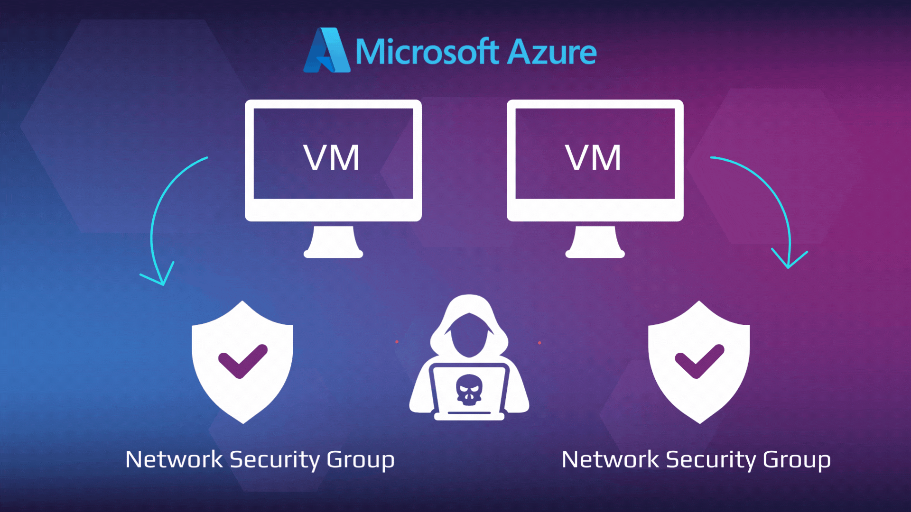

# Configuring and Implementing a Honeynet in Azure




### To kick off my Azure Honeynet project, we must first set up the virtual machines (VMs) we'll use. Virtual machines are like computers in the cloud, and they'll form the foundation of our honeynet. Here are the steps we'll take in Microsoft Azure:

1. **Sign in to the Azure portal:** The first step is to log into your Azure account. If you don't have an account yet, **[you'll need to create one!](https://portal.azure.com)**

<details close> 
<summary> 2. Create a virtual machine: </summary>


- Once you're in the Azure portal, either click on the Virtual Machines icon in the top menu bar or use the search "vms" in the search box and select "Virtual Machines". 
  
  

  
  
- Click on 'Create', then 'Virtual machine'. This is where we'll set up our new VM!
  
 
  
  
  </details>
  
  
  <details close> 
<summary> 3. Configure the VM settings: </summary>
  
  - **Subscription and resource group:** We'll select our Azure subscription and resource group (Which is way to group and manage resources in Azure!). For the purpose of the project, I already created created a resource group called ```RG-Cyber-Lab2``` 
  
  - **Virtual Machine Name:** For the purpose of this project, I am going to name this VM, ```Lab-HoneyNet```

  - **Region:** For the purpose of this project, I am going to choose the region, ```(US) East US 2```
  
  - **Availability Options:** Being that the only purpose of this machine will be to act as a Honeypot, we do not require any form of availability, so I selected ```No infrastructure redundancy required```

  - **Image:** Select ```Windows 10 Pro, version 21H2 - x64 Gen2```
  
  
  
  - **Networking**: When creating the virtual network, we will be leaving it to the default settings. For the purpose of this lab, I called mine ```Lab-VNet```.
  
  


  </details>


<details close> 
<summary> 4. NSG/Inbound Security Rule Configuration: </summary>
 
  - **Navigate to the Network Security Group (NSG):** In the Azure portal, search for 'Network Security Groups' in the search bar at the top. Once there, select the NSG associated with your virtual machine.
  
  - **Create an inbound security rule:** Inside the NSG, you'll find a section for 'Inbound security rules'. This is where we control what kind of traffic is allowed to reach our VM. Click on 'Add' to create a new rule.
  - **Configure the rule:** We'll be prompted to input some details about our new rule.
  
  - **Source:** This defines where the incoming traffic is coming from. We can set this to ```Any``` to allow traffic from any location.
  
  - **Source port ranges:** This specifies the ports on the source (the computer initiating the connection) that are allowed. Again, we can set this to ```*``` or ```Any``` to allow all ports.

  - **Destination:** This defines where the traffic is going to. Since we want the traffic to reach our VM, we can set this to ```Any```.
  
  - **Destination port ranges:** This specifies the ports on our VM that are allowed to receive traffic. We can set this to ```*``` or ```Any``` to open all ports.
  
  - **Priority:** Setting priorities in Network Security Groups (NSGs) is an essential step. The priority determines the order in which rules are applied. Rules with lower priority numbers are processed before rules with higher priority numbers because the lower the number, the higher the priority. For the purpose of this lab, I set the priority to ```300``` to ensure that this honeypot functions as intended!

  - **Action:** We'll set this to ```Allow```, which means that traffic matching this rule will be allowed to reach our VM. 
  
 

  
  - **Review & Create:** After i've input and configured all the details we need for this inbound rule, click 'Add' to create the rule. e
 
 
 
 
 
 
 
 
 
</details>

# Conclusion

### By creating our VMs and open inbound security rules, we're essentially leaving the front door of our VM wide open. This is generally not something you'd do in a real production environment, as it would make your system extremely vulnerable to attacks. However, in the context of our honeynet, it's exactly what we want to do!

### This allows us to attract potential attackers and observe their actions in a controlled environment.
 
